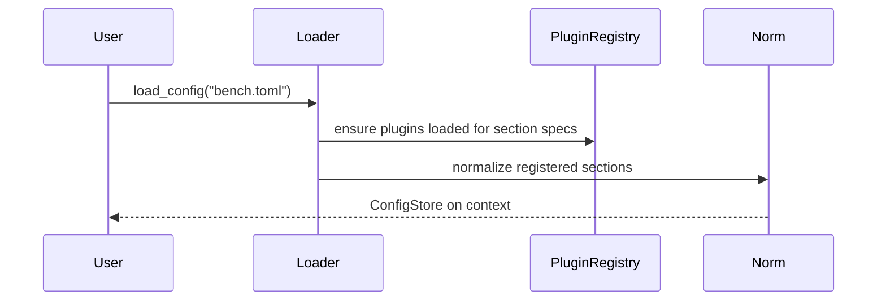

# DDD: Configuration System

> **Archived planning document.** For current behavior see [scope.md](../../../scope.md), Sphinx user guides, examples, and the codebase. Bench section keys are listed in the docgen **Bench configuration reference** (`python scripts/docgen/build_all.py`). Wave references below are historical only.

## Responsibilities

Load TOML bench files, normalize repeatable sections (core and plugin-registered), validate IDs, expose read API to core and extensions, and preserve project-specific extension config without hard-coding every prefix in core.

## Public API surface

```python
def load_config(path: Union[str, Path]) -> ConfigStore:
    """Parse TOML, normalize, init runtime context, return store."""

class ConfigStore:
    def get_section(self, dotted: str) -> Any
    def get_item(self, dotted: str, item_id: int) -> dict
    def list_items(self, dotted: str) -> List[dict]
    def raw(self) -> dict

    # Convenience aliases used by first-party plugins
    def get_equipment(self, kind: str, equipment_id: int) -> dict
    def list_equipment(self, kind: str) -> List[dict]
```

`get_item("equipment.psu", psu_id=1)` resolves via registered `id_field` for that section.

## Plugin-facing config registration

Extensions declare repeatable TOML sections at register time (architecture §8.4, §6). Core does not hard-code only `equipment` / `shared`.

```python
@dataclass(frozen=True)
class ConfigSectionSpec:
    dotted_path: str       # e.g. "equipment.psu", "shared.ssh", "myproduct.fixture"
    id_field: str          # e.g. "psu_id", "ssh_id", "fixture_id"
    required_keys: Tuple[str, ...] = ()  # validated at use-time if missing

# In plugin register():
registry.register_config_section(
    ConfigSectionSpec("equipment.psu", "psu_id", required_keys=("resource",))  # driver defaults to visa
)
registry.register_config_section(
    ConfigSectionSpec("shared.ssh", "ssh_id", required_keys=("host", "username"))
)
registry.register_config_validator("equipment.psu", validate_psu_section)
```

Project-specific extension config uses the same mechanism:

```toml
[myproduct.fixture]
fixture_id = 1
serial = "ABC123"
```

```python
registry.register_config_section(
    ConfigSectionSpec("myproduct.fixture", "fixture_id")
)
```

## Normalization algorithm

1. Parse TOML to dict.
2. For each registered `ConfigSectionSpec.dotted_path`:
   - If value is a dict → wrap as single-element list
   - If value is a list → use as-is
   - Index entries by `id_field`; reject duplicate IDs for that section
3. Sections not registered remain in `raw()` tree accessible via `get_section` (passthrough for ad hoc config).
4. First-party plugins register all supported `equipment.*` and `shared.*` sections at load time.

## Validation ([ADR-003](../decisions/adr-003-config-validation.md))

- Parse errors → `ConfigError`
- Duplicate ID within a registered section → `ConfigError` at load
- Missing `required_keys` → error at first use (connection/open), with section + id in message
- Unknown keys in a section → WARNING in `debug.log`
- Plugin `validate_section(dict) -> List[str]` optional hook for warnings/errors

## Relationship to runtime init

`load_config` is the user-facing entry that attaches `ConfigStore` to the active context (see [ddd-runtime-context.md](ddd-runtime-context.md)). The runner calls the same function when `--config` is provided.

## Data written

```text
run_metadata: config_path, config_hash (optional)
```

## Sequence — load with plugin sections



## Extension points

- `register_config_section(ConfigSectionSpec)`
- `register_config_validator(dotted_path, callable)`

## Open issues

- Variable substitution `${ENV}`: post-MVP.

## References

- [ffo-bench-configuration.md](../features/ffo-bench-configuration.md)
- [ADR-003](../decisions/adr-003-config-validation.md)
- [ddd-plugin-registry.md](ddd-plugin-registry.md)
- Architecture §8.4, §11 (plugin config)
