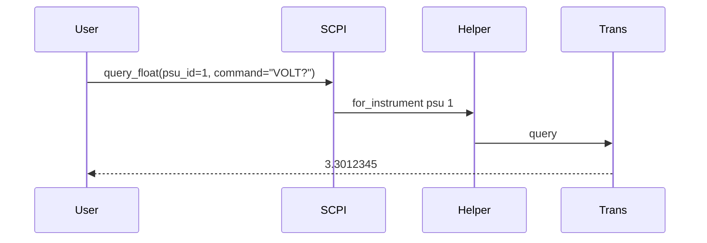

# DDD: Equipment SCPI Protocol Helpers

> **Archived planning document.** For current behavior see [scope.md](../../../scope.md), Sphinx user guides, examples, and the codebase. Wave references below are historical only.


## Responsibilities

Thin SCPI layer on top of transports: command formatting, response stripping, optional error-queue check. User-facing API resolves transport from bench config by instrument id.

## Public API surface

Instrument-bound API (primary — matches architecture escape hatch style):

```python
class SCPIHelper:
  def write(self, command: str) -> None
  def query(self, command: str) -> str
  def query_float(self, command: str) -> float

def for_instrument(kind: str, equipment_id: int) -> SCPIHelper
```

Module-level shorthand (delegates to `for_instrument`):

```python
# col.equipment.scpi
def write(*, psu_id: Optional[int] = None, dmm_id: Optional[int] = None, ..., command: str) -> None
def query(*, psu_id: Optional[int] = None, dmm_id: Optional[int] = None, ..., command: str) -> str
def query_float(*, psu_id: Optional[int] = None, dmm_id: Optional[int] = None, ..., command: str) -> float
```

Exactly one `*_id` keyword selects the instrument kind and id. Implementation maps to `for_instrument("psu", psu_id)`.

Examples:

```python
voltage = col.equipment.scpi.query_float(psu_id=1, command="VOLT?")
# equivalent: col.equipment.scpi.for_instrument("psu", 1).query_float("VOLT?")
```

Low-level transport-only helpers (extension/internal use):

```python
def write_transport(transport: Transport, command: str) -> None
def query_transport(transport: Transport, command: str) -> str
```

## Error handling

- Timeout → `EquipmentTimeoutError`
- Non-numeric parse → `EquipmentResponseError`

## Data written

None; callers use `@measurement` for persistence when wrapping in high-level APIs.

## Sequence — query float via shorthand



## Extension points

Vendor instruments may bypass helpers for binary blocks post-MVP.

## References

- [ddd-equipment-transports.md](ddd-equipment-transports.md)
- [ddd-equipment-dmm-psu.md](ddd-equipment-dmm-psu.md)
- Architecture §14.1
