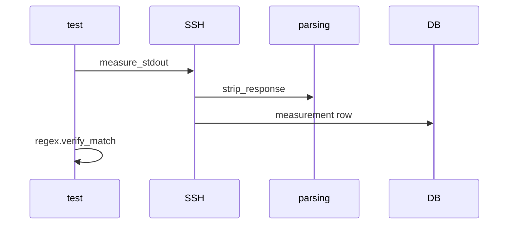

# DDD: Shared Package Architecture

> **Archived planning document.** For current behavior see [scope.md](../../../scope.md), Sphinx user guides, examples, and the codebase. Wave references below are historical only.


## Responsibilities

Structure `colosseum-shared` plugin: SSH, regex, filesystem, subprocess, and **common parsing utilities** under `col.shared` namespace (architecture §15).

## Package layout

```text
colosseum_shared/
  __init__.py       # register()
  ssh/
    client.py
    api.py
  regex/
    api.py
  filesystem/
    api.py
  subprocess/
    api.py
  parsing/          # common helpers (not measurements)
    __init__.py
    text.py
    numbers.py
```

## Registration

```python
def register(registry):
    import colosseum_shared
    registry.register_namespace("shared", colosseum_shared.api)
    registry.register_config_section(ConfigSectionSpec("shared.ssh", "ssh_id", ...))
    # filesystem, etc. as needed
```

## Public API modules (MVP)

| Module | Functions |
|--------|-----------|
| `col.shared.ssh` | `measure_stdout`, `run` |
| `col.shared.regex` | `verify_match` |
| `col.shared.filesystem` | `measure_file_exists`, `verify_file_exists` |
| `col.shared.subprocess` | `run_checked` |
| `col.shared.parsing` | See below |

### Common parsing utilities (`col.shared.parsing`)

Non-decorated helpers for use inside measurements/verifications or test scripts:

| Function | Purpose |
|----------|---------|
| `strip_response(text: str) -> str` | Trim whitespace and line endings from command output |
| `parse_float(text: str) -> float` | Parse first float from instrument/CLI text |
| `parse_float_list(text: str, sep: str = ",") -> List[float]` | Split numeric list responses |
| `parse_key_value_lines(text: str) -> dict` | Parse `key=value` per line (e.g. `fw=1.2`) |
| `first_match_group(pattern: str, text: str) -> Optional[str]` | Regex helper without full verify wrapper |

These do not write to SQLite by themselves; they support measurement implementations.

## Connection lifecycle

- SSH: one `paramiko.SSHClient` per `ssh_id` cached on context; close on `endex()`

## Data written

Core SQLite tables only when using `@measurement` / `@verification` APIs.

## Sequence



## References

- [ddd-shared-ssh-regex.md](ddd-shared-ssh-regex.md)
- [ffo-host-dut-utilities.md](../features/ffo-host-dut-utilities.md)
- Architecture §15
