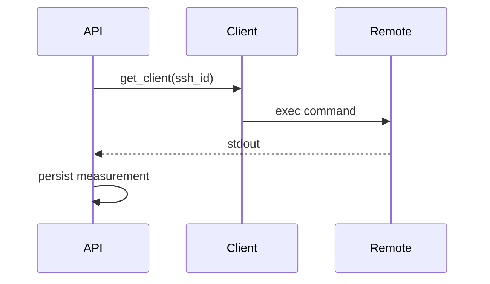
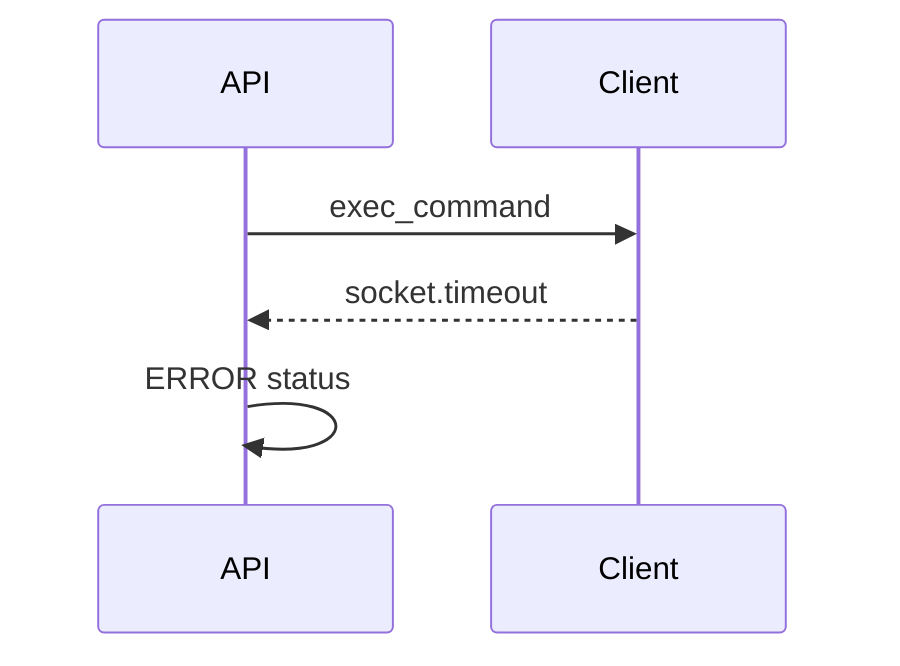

# DDD: Shared SSH, Regex, and Subprocess

> **Archived planning document.** For current behavior see [scope.md](../../../scope.md), Sphinx user guides, examples, and the codebase. Wave references below are historical only.


## Responsibilities

Implement SSH measurement, regex verification against prior keys, minimal filesystem and subprocess helpers.

## Public API surface

```python
@measurement
def measure_stdout(ssh_id: int, command: str, key: str, timeout: float = 30.0) -> str

@measurement
def measure_file_exists(path: str, key: str) -> bool

@verification(sources=[MeasurementSource("shared", "measure_stdout")])
def verify_match(
    key: str,
    pattern: str,
    optional: bool = False,
    sources: Optional[Sequence[MeasurementSource]] = None,
) -> VerificationResult

@verification
def verify_file_exists(key: str, expected: bool = True, optional: bool = False) -> VerificationResult

def run_checked(command: List[str], timeout: float = 60.0) -> int  # not a verification; raises on failure
```

## Config

```toml
[[shared.ssh]]
ssh_id = 1
host = "192.168.1.10"
port = 22
username = "root"
password = "..."  # or key_filename
key_filename = ""
timeout = 30.0
```

Validation: `host`, `username` required; auth via password or key.

## SSH flow

1. Resolve config for `ssh_id`
2. Connect paramiko (AutoAddPolicy for MVP lab use; document security note)
3. `exec_command(command)`; read stdout (stderr optional WARN log)
4. Store stdout string in `value_json`; return str

## Regex verification

1. Resolve evidence from declared `MeasurementSource` list (default `shared` / `measure_stdout`; override via `sources=` when verifying output from another measurement command)
2. `re.search(pattern, actual)` → PASS if match else FAIL
3. Missing measurement → ERROR

## Data written

`measurements` / `verifications` with domain `shared`.

## Sequence — SSH happy path



## Sequence — SSH timeout



## Security note

Passwords in TOML are acceptable for offline bench MVP; document migration to env vars post-MVP.

## References

- [ffo-host-dut-utilities.md](../features/ffo-host-dut-utilities.md)
- [ddd-configuration.md](ddd-configuration.md)
