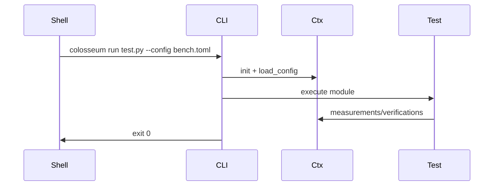
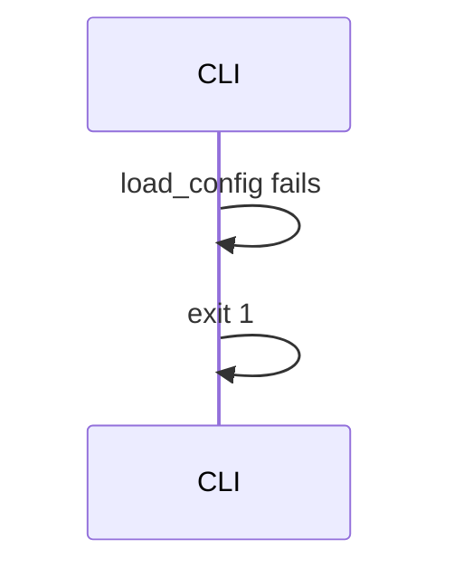

# DDD: CLI Runner

## Responsibilities

Provide `colosseum` console script: `run` (Wave 1), `run-suite` (Wave 3), argument parsing, context init, test module execution, exit code propagation.

## Public API surface

```bash
colosseum run <test.py> [--config PATH] [--verbose]
colosseum run-suite <suite.toml> [--config PATH] [--verbose]  # Wave 3
```

```python
# colosseum/runner/cli.py
def main(argv: Optional[List[str]] = None) -> None:
    sys.exit(run_cli(argv))
```

## `run` implementation

1. Parse args; resolve paths relative to CWD
2. If `--config`: `load_config(path)` (initializes context internally per [ddd-runtime-context.md](ddd-runtime-context.md))
3. Else: internal `init_context(test_case_name=stem, config_path=None)` only
4. Lazy `setup_logging` when output dir is first ensured (on first persist)
5. Load test module via `runpy.run_path` or importlib (preserve `__name__ == "__main__"` block if present)
6. `endex()` in `finally` (same as direct-Python tests)

## Direct Python parity

- Test script calls `col.config.load_config(...)` — same initialization path as CLI with `--config`
- Test scripts call `col.endex()` explicitly when not using CLI; runner invokes `endex()` in `finally`

## Data written

Delegates to output, logging, database subsystems.

## Sequence — happy path



## Sequence — config missing



## Extension points

None.

## Open issues

- `--log-level DEBUG`: use `--verbose` mapping to DEBUG in v1.

## References

- [ddd-runtime-context.md](ddd-runtime-context.md)
- [ddd-suite-orchestration.md](ddd-suite-orchestration.md) (Wave 3)
- [ffo-single-test-execution.md](../features/ffo-single-test-execution.md)
