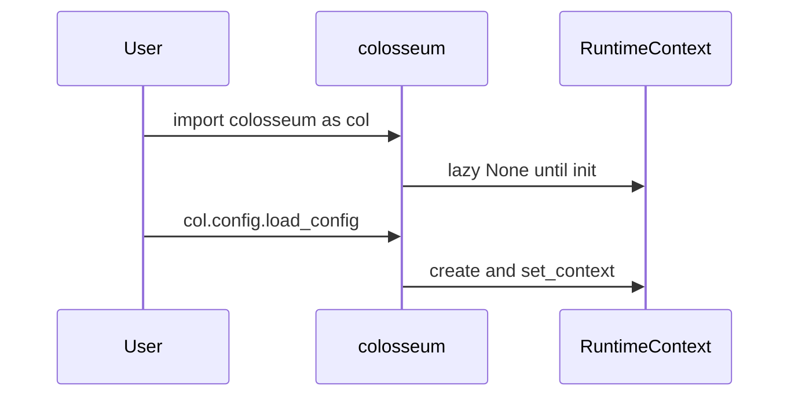

# DDD: Core Package Layout and Public API

> **Documentation note:** Normative behavior is in [mvp/scope.md](../mvp/scope.md), Sphinx user guides, and the codebase. Wave 1/2/3 references below are historical sequencing only.


## Responsibilities

Define the `colosseum` Python package structure, public exports, and import conventions for core and CLI.

## Package layout

```text
colosseum/
  __init__.py          # version, re-exports col-friendly aliases
  context.py           # RuntimeContext, get_context(), set_context()
  config/
    __init__.py        # load_config (initializes runtime), get_section
    sections.py        # ConfigSectionSpec
    loader.py
    normalize.py
  output/
    __init__.py
    paths.py           # allocate_run_directory
    artifacts.py
  logging/
    __init__.py
    setup.py
  database/
    __init__.py
    manager.py
    schema.py
    records.py         # dataclasses (Wave 3 read API)
    read.py            # read_* helpers (Wave 3)
  results/
    __init__.py
    aggregation.py
    exit_policy.py
  decorators/
    __init__.py
    measurement.py
    verification.py
  plugins/
    __init__.py
    registry.py
    loader.py
  runner/
    __init__.py
    cli.py             # entry point: colosseum
    single_test.py
    suite.py           # Wave 3
  summary/
    writer.py          # Wave 3
```

## Public API surface (Wave 1)

| Symbol | Module | Notes |
|--------|--------|-------|
| `colosseum.__version__` | `__init__` | PEP 440 |
| `col.config.load_config(path)` | `config` | Initializes context |
| `col.config.get(...)` | `config` | Typed access after load |
| `measurement`, `verification` | `decorators` | `@measurement`, `@verification` |
| `col.endex()` | `__init__` or `results` | End run: flush logs/DB, exit `0`/`1` |
| `colosseum.run` CLI | `runner.cli` | `console_scripts` entry |

Namespace placeholders (lazy, Wave 2):

- `col.equipment`, `col.shared` — `NamespaceProxy` until plugins load

## `pyproject.toml` (core)

```toml
[project]
name = "colosseum"
dependencies = ['tomli; python_version < "3.11"']

[project.scripts]
colosseum = "colosseum.runner.cli:main"

[project.entry-points."colosseum.plugins"]
# empty in core; extensions add rows
```

## Extension points

- Entry point group `colosseum.plugins`
- Decorators accept `domain` and `command` metadata via function module/name defaults

## Data written

None at import time.

## Sequence — package import



## Open issues

- Meta-package `colosseum-bench` bundling all three wheels: post-MVP.

## References

- [ADR-001](../decisions/adr-001-distributions.md)
- [ddd-runtime-context.md](ddd-runtime-context.md)
