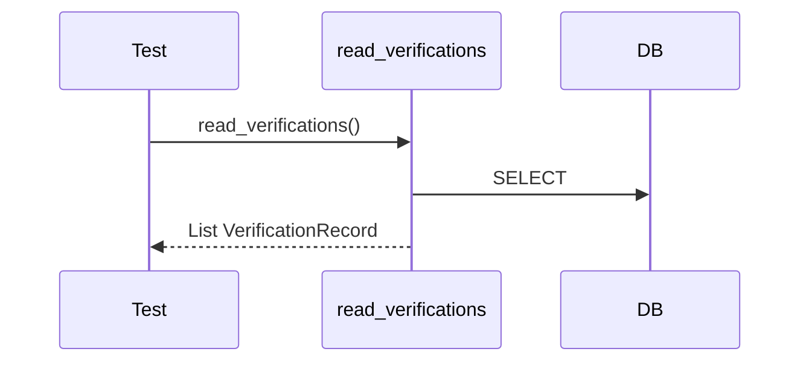

# DDD: Database Read API

> **Documentation note:** Normative behavior is in [mvp/scope.md](../mvp/scope.md), Sphinx user guides, and the codebase. Wave 1/2/3 references below are historical sequencing only.


## Responsibilities

Expose typed read helpers for **inspection and tooling** during or after a run without raw SQL ([ADR-005](../decisions/adr-005-database-read-api.md)). Pass/fail and process exit are handled by `col.endex()` ([ddd-results-exit-codes.md](ddd-results-exit-codes.md)); tests must not use read helpers to gate exit.

## Public API surface

```python
# colosseum/database/records.py
@dataclass(frozen=True)
class MeasurementRecord:
    id: int
    domain: str
    command: str
    key: str
    row_index: int
    value: Any
    units: Optional[str]
    artifact_path: Optional[str]
    status: str
    timestamp: str

@dataclass(frozen=True)
class VerificationRecord:
    id: int
    domain: str
    command: str
    key: str
    expected: Any
    actual: Any
    status: str
    optional: bool
    message: Optional[str]
    timestamp: str

# colosseum/database/read.py
def read_measurements() -> List[MeasurementRecord]
def read_verifications() -> List[VerificationRecord]
def read_run_metadata() -> List[RunMetadataRecord]
def read_table(name: str) -> List[dict]
```

Attached to user namespace:

```python
col.database.read_measurements()
```

## Behavior

- Requires active `RuntimeContext` with open DB
- JSON columns deserialized to Python types
- `read_table`: allow `measurements`, `verifications`, `events`, `artifacts`, `run_metadata`, and `plugin_*` tables
- Unknown table → `ValueError`

## Data written

None (read-only).

## Sequence — post-run inspection in test



## Extension points

Plugins document their `plugin_*` table columns; `read_table` returns dict rows.

## Open issues

- `read_from_path(sqlite_path)` for offline analysis: post-MVP.

## References

- [ddd-database.md](ddd-database.md)
- [ffo-execution-evidence.md](../features/ffo-execution-evidence.md)
