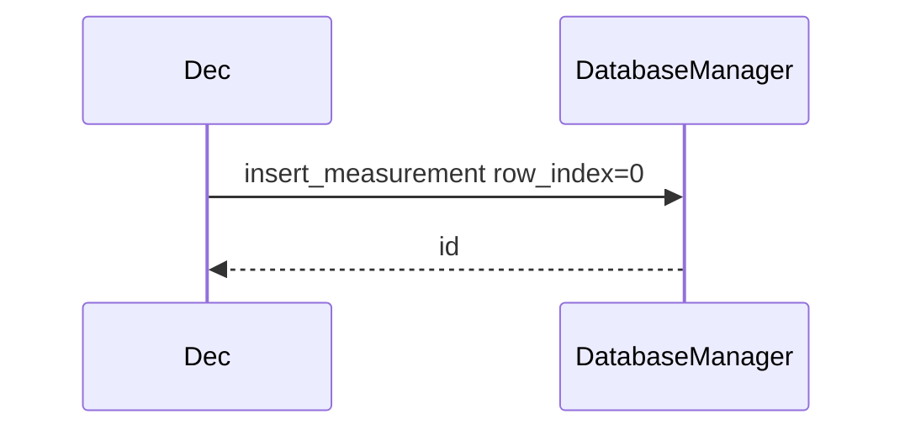
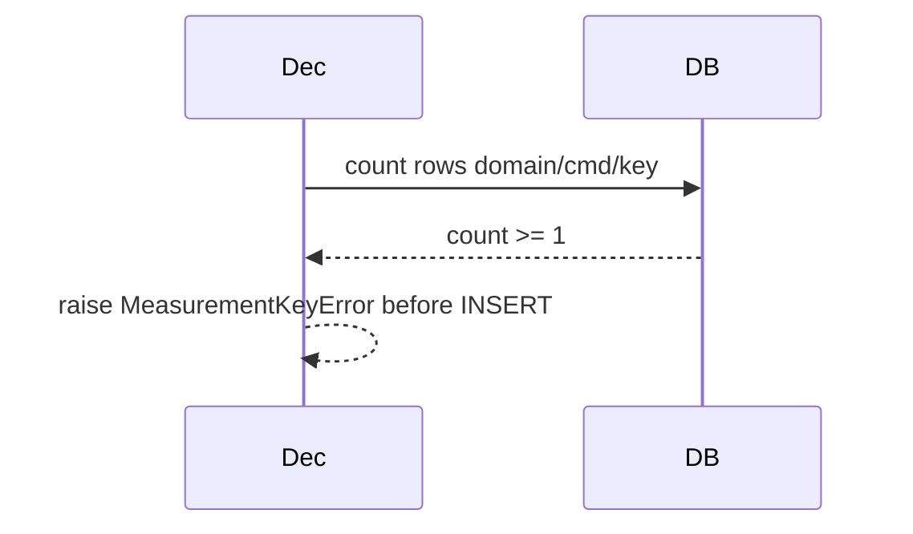
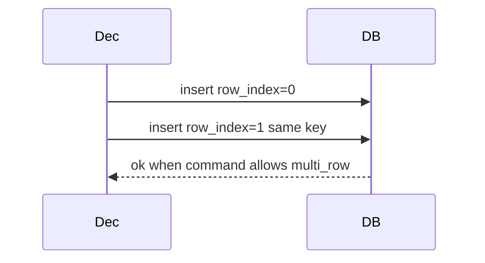

# DDD: SQLite Persistence

> **Documentation note:** Normative behavior is in [mvp/scope.md](../mvp/scope.md), Sphinx user guides, and the codebase. Wave 1/2/3 references below are historical sequencing only.


## Responsibilities

Create schema, manage connection lifecycle, insert/query measurements and verifications, support plugin table creation.

## Public API surface (internal + Wave 3 read)

```python
class DatabaseManager:
    def initialize(self, db_path: Path) -> None
    def insert_measurement(self, row: MeasurementRow) -> int
    def insert_verification(self, row: VerificationRow) -> int
    def insert_event(self, level: str, source: str, message: str) -> int
    def insert_run_metadata(self, key: str, value: str) -> None
    def get_measurement(
        self,
        domain: str,
        command: str,
        key: str,
        row_index: int = 0,
    ) -> Optional[MeasurementRow]
    def list_measurements(
        self,
        domain: str,
        command: str,
        key: str,
    ) -> List[MeasurementRow]
    def close(self) -> None
```

## Schema v1

There is **no** global unique index on `(domain, command, key)` alone. Architecture §11.2 allows multiple rows per logical key when a measurement command documents that behavior (e.g. spectrum/trace points). Uniqueness is enforced in application logic per command (see [ddd-measurement-verification.md](ddd-measurement-verification.md)).

```sql
CREATE TABLE run_metadata (
  key TEXT PRIMARY KEY,
  value TEXT NOT NULL
);

CREATE TABLE measurements (
  id INTEGER PRIMARY KEY AUTOINCREMENT,
  domain TEXT NOT NULL,
  command TEXT NOT NULL,
  key TEXT NOT NULL,
  row_index INTEGER NOT NULL DEFAULT 0,
  value_json TEXT,
  units TEXT,
  artifact_path TEXT,
  status TEXT NOT NULL,
  timestamp TEXT NOT NULL
);

CREATE INDEX idx_measurements_lookup
  ON measurements(domain, command, key);

CREATE TABLE verifications (
  id INTEGER PRIMARY KEY AUTOINCREMENT,
  domain TEXT NOT NULL,
  command TEXT NOT NULL,
  key TEXT NOT NULL,
  expected_json TEXT,
  actual_json TEXT,
  status TEXT NOT NULL,
  optional INTEGER NOT NULL DEFAULT 0,
  message TEXT,
  timestamp TEXT NOT NULL
);

CREATE TABLE events (
  id INTEGER PRIMARY KEY AUTOINCREMENT,
  level TEXT NOT NULL,
  source TEXT NOT NULL,
  message TEXT NOT NULL,
  timestamp TEXT NOT NULL
);

CREATE TABLE artifacts (
  id INTEGER PRIMARY KEY AUTOINCREMENT,
  kind TEXT NOT NULL,
  path TEXT NOT NULL,
  description TEXT,
  timestamp TEXT NOT NULL
);
```

### `row_index` discriminator

| Command mode | `row_index` | Uniqueness rule (application layer) |
|--------------|-------------|-----------------------------------|
| Single-row (default) | Always `0` | At most one row per `(domain, command, key)` |
| Multi-row (opt-in per command) | Caller-supplied or auto-assigned | Unique per `(domain, command, key, row_index)` |

Trace/spectrum style commands should prefer **one** measurement row with `artifact_path` pointing at CSV/binary in the output directory, plus verifications against the artifact (architecture §11.2). Use multi-row only when a command explicitly documents row-per-point storage.

Plugin tables: `plugin_<plugin>_<table>` created via `DatabaseManager.create_plugin_table(...)`.

## Data written

`outputs/<run>/execution.sqlite`

## Sequence — insert measurement (single-row)



## Sequence — duplicate key rejected



## Sequence — multi-row insert



## Extension points

- `create_plugin_table(name, columns_def)`
- Read API in [ddd-database-read-api.md](ddd-database-read-api.md) includes `row_index` on `MeasurementRecord`

## Open issues

- WAL mode for concurrent readers: enable if needed.

## References

- [ADR-005](../decisions/adr-005-database-read-api.md)
- [ddd-measurement-verification.md](ddd-measurement-verification.md)
- Architecture §11.2
