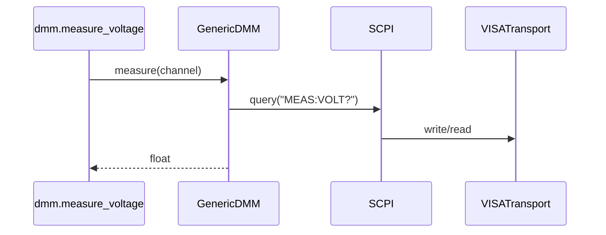

# DDD: Equipment Package Architecture

> **Documentation note:** Normative behavior is in [mvp/scope.md](../mvp/scope.md), Sphinx user guides, and the codebase. Wave 1/2/3 references below are historical sequencing only.


## Responsibilities

Structure `colosseum-equipment` as layers: transport → protocol → instrument abstraction → vendor/model implementation.

## Package layout

```text
colosseum_equipment/
  __init__.py          # register()
  transports/
    visa.py
    serial_transport.py
  protocols/
    scpi.py
  instruments/
    psu/
      base.py
      generic.py
      tdk_genesys.py    # Wave 3
    dmm/
      base.py
      generic.py
      keysight_edu34450a.py  # Wave 3
  api/                 # user-facing namespace attachment
    psu.py
    dmm.py
    serial.py
    visa.py
    scpi.py
```

## Layer contracts

| Layer | Responsibility |
|-------|----------------|
| Transport | Bytes on wire: VISA resource, pyserial port |
| Protocol | SCPI formatting, query/write/read |
| Instrument | `measure_voltage`, `set_output`, etc. |
| Vendor | Model-specific command strings and parsing |

## Public API (attached to `col.equipment`)

High-level: `psu`, `dmm` modules with decorated functions.

Low-level: `visa`, `scpi`, `serial` modules.

## Connection lifecycle

- Per-run connection cache keyed by `(kind, id)` on runtime context
- Close all in `endex()`

## Data written

Via decorators to core DB; artifacts via `register_artifact`.

## Sequence — measure voltage



## Extension points

Third-party equipment plugins may add parallel package or register sub-namespaces under `col.equipment.vendor_x` (convention).

## Open issues

- Socket transport: stub for post-MVP.

## References

- [ddd-equipment-transports.md](ddd-equipment-transports.md)
- [ADR-006](../decisions/adr-006-vendor-instruments.md)
