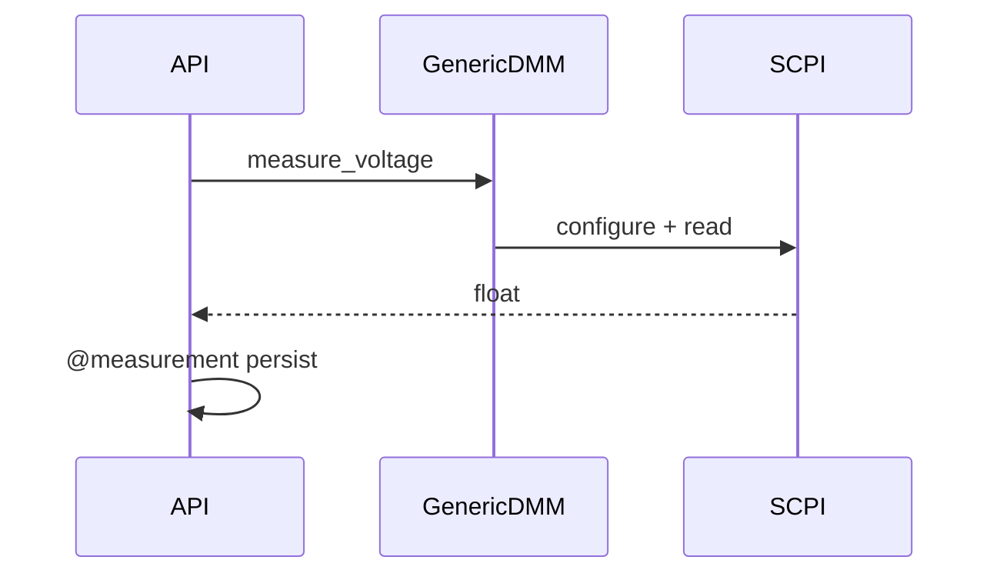

# DDD: Equipment DMM and PSU Instrument Modules

> **Documentation note:** Normative behavior is in [mvp/scope.md](../mvp/scope.md), Sphinx user guides, and the codebase. Wave 1/2/3 references below are historical sequencing only.


## Responsibilities

Implement high-level DMM and PSU APIs with `@measurement` / `@verification`, generic SCPI (Wave 2), vendor reference drivers (Wave 3).

## Public API surface

```python
# col.equipment.dmm
def measure_voltage(dmm_id: int, channel: int, key: str) -> float
def verify_voltage(key: str, expected_val: float, tolerance: float, optional: bool = False) -> VerificationResult

# col.equipment.psu
def set_voltage(psu_id: int, voltage: float) -> None
def set_current_limit(psu_id: int, current: float) -> None
def set_output(psu_id: int, enabled: bool) -> None
def measure_voltage(psu_id: int, key: str) -> float  # optional readback
def verify_voltage(key: str, expected_val: float, tolerance: float, optional: bool = False) -> VerificationResult
```

## Model selection

Factory reads config `model`:

| model | Class |
|-------|-------|
| omitted / `generic` | `GenericDMM`, `GenericPSU` |
| `keysight-edu34450a` | `KeysightEDU34450A` (Wave 3) |
| `tdk-genesys` | `TdkGenesysPSU` (Wave 3) |

## Wave 2 — Generic SCPI (illustrative)

**DMM measure voltage:**

- `CONF:VOLT:DC` (channel mapping instrument-specific; generic uses channel as suffix if supported)
- `READ?` → float

**PSU:**

- `VOLT {v}` / `CURR {i}` / `OUTP ON|OFF`
- Readback: `MEAS:VOLT?` for verify helpers

Exact strings tuned during implementation against bench hardware; escape hatch for mismatches.

## Wave 3 — Keysight EDU34450A

Per instrument manual (implementation reference):

- Use EDU34450A-specific configuration for DC voltage on channel
- Parse measurement per manual format
- Handle channel/range prerequisites in driver `prepare_channel(channel)`

Test scripts unchanged:

```python
col.equipment.dmm.measure_voltage(dmm_id=1, channel=1, key="vrail_3v3")
```

Config:

```toml
[equipment.dmm]
dmm_id = 1
model = "keysight-edu34450a"
resource = "USB0::..."
```

## Wave 3 — TDK-Lambda Genesys

Per Genesys manual:

- Voltage/current programming commands per Genesys SCPI subset
- Status and output enable semantics
- OVP/OCP from config applied at connection if keys present

Config:

```toml
[equipment.psu]
psu_id = 1
model = "tdk-genesys"
resource = "GPIB0::5::INSTR"
voltage = 3.3
ovp = 3.6
ocp = 1.0
```

## Verification bindings

Both `verify_voltage` implementations declare explicit measurement sources ([ddd-measurement-verification.md](ddd-measurement-verification.md)):

```python
@verification(sources=[MeasurementSource("equipment", "measure_voltage")])
def verify_voltage(key: str, expected_val: float, tolerance: float, optional: bool = False):
    ...
```

## verify_voltage logic

1. Load measurement via `get_measurement("equipment", "measure_voltage", key, row_index=0)`
2. `actual = float(value)`
3. PASS if `abs(actual - expected) <= tolerance` else FAIL

## Data written

Standard `measurements` / `verifications` rows; domain `equipment`, commands `measure_voltage`, `verify_voltage`, etc.

## Sequence — generic measure



## Open issues

- AC voltage / current rails: post-MVP APIs.

## References

- [ADR-006](../decisions/adr-006-vendor-instruments.md)
- [ffo-laboratory-equipment.md](../features/ffo-laboratory-equipment.md)
- [ddd-equipment-vsg-speca.md](ddd-equipment-vsg-speca.md) — RF VSG and spectrum analyzer APIs
