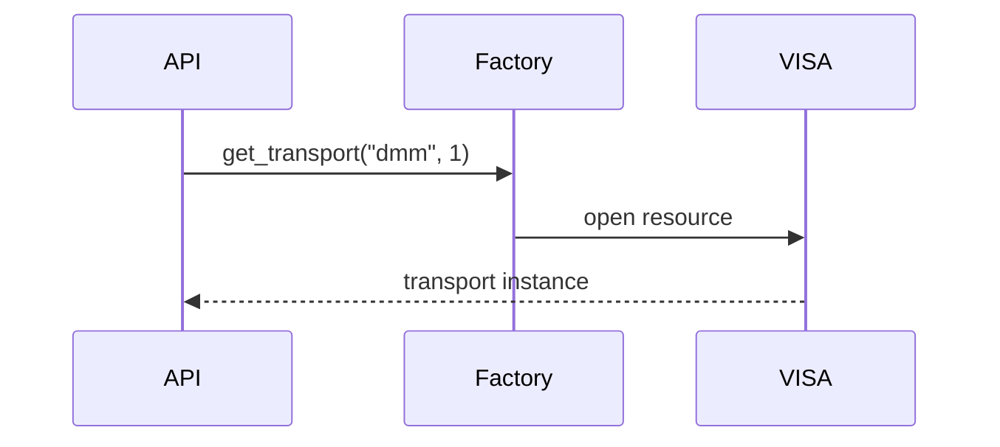
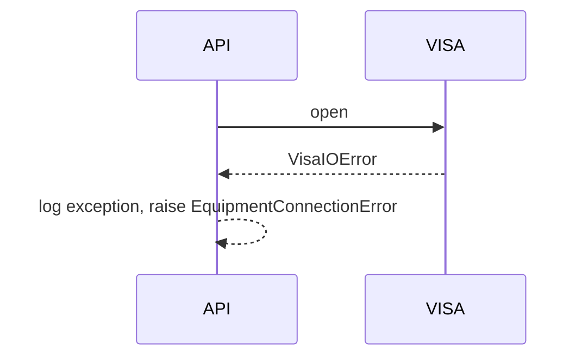

# DDD: Equipment Transports (VISA and Serial)

> **Documentation note:** Normative behavior is in [mvp/scope.md](../mvp/scope.md), Sphinx user guides, and the codebase. Wave 1/2/3 references below are historical sequencing only.


## Responsibilities

Open and manage VISA resources (pyvisa) and serial ports (pyserial) from normalized config.

## Public API surface

```python
class VISATransport:
    def __init__(self, resource: str, timeout: float)
    def write(self, data: str) -> None
    def read(self) -> str
    def query(self, data: str) -> str
    def close(self) -> None

class SerialTransport:
    def __init__(self, port: str, baudrate: int, timeout: float)
    def write(self, data: bytes) -> None
    def read_until(self, terminator: bytes, timeout: Optional[float]) -> bytes
    def close(self) -> None

def get_transport(equipment_kind: str, equipment_id: int) -> Union[VISATransport, SerialTransport]
```

## Config mapping

| driver | Implementation |
|--------|----------------|
| `visa` | `VISATransport` with `resource` string |
| `serial` | `SerialTransport` with `port`, `baudrate` |

`interface` field documents intent (gpib, ethernet, usbtmc); resource string is authoritative for VISA.

## Data written

None directly; logging at DEBUG for TX/RX optional (truncated).

## Sequence — happy path



## Sequence — connection error



## Extension points

Future `socket` transport in same factory.

## References

- [ddd-equipment-scpi.md](ddd-equipment-scpi.md)
- [ddd-configuration.md](ddd-configuration.md)
