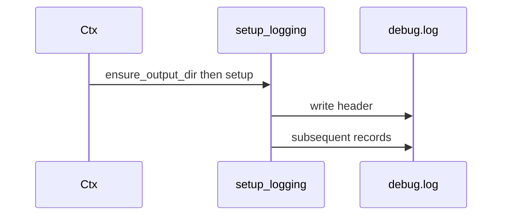
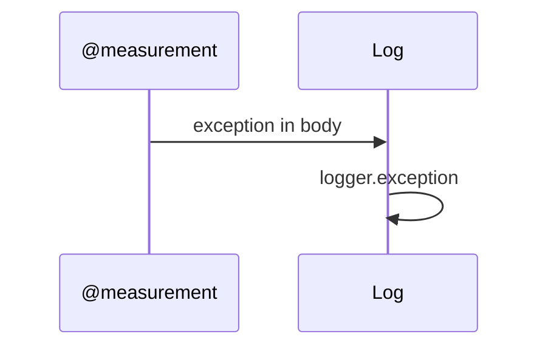

# DDD: Logging

## Responsibilities

Configure Python `logging` for Colosseum runs: file handler to `debug.log`, console handler optional (CLI `--verbose`), header metadata, namespaced loggers for plugins.

## Public API surface

```python
def setup_logging(output_dir: Path, *, console: bool = False) -> logging.Logger
def get_logger(name: str) -> logging.Logger  # e.g. "colosseum.equipment.dmm"
```

## Header block (first lines of debug.log)

```text
Colosseum version: {version}
Python version: {sys.version}
Platform: {platform.platform()}
Test case: {test_case_name}
Suite: {suite_name or N/A}
Start time: {iso8601}
Config file: {config_path or N/A}
Output directory: {output_dir}
```

## Log levels

- DEBUG, INFO, WARNING, ERROR
- Exceptions: `logger.exception` in decorator error paths

## Data written

`outputs/<run>/debug.log` — append mode, UTF-8.

## Sequence — happy path



## Sequence — measurement error



## Extension points

Plugins use `get_logger(__name__)`.

## Open issues

- Log rotation within long suite: post-MVP.

## References

- [ddd-output-artifacts.md](ddd-output-artifacts.md)
- [ffo-execution-evidence.md](../features/ffo-execution-evidence.md)
