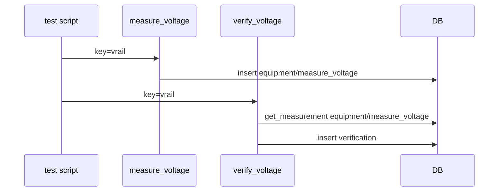
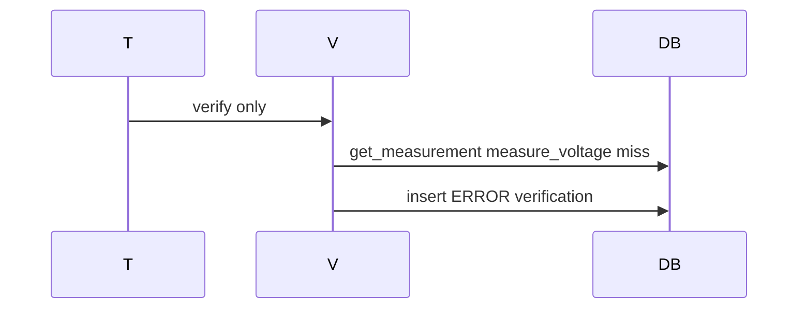

# DDD: Measurement and Verification Framework

## Responsibilities

Provide `@measurement` and `@verification` decorators, wire logging/DB/aggregation, enforce per-command key rules, support `optional` on verifications, and resolve verification evidence via **explicit measurement sources** (not implicit command-name matching).

## Public API surface

```python
from colosseum.decorators import measurement, verification, MeasurementSource

@measurement  # default: multi_row=False
def example_measure(key: str, ...) -> float:
    """Sphinx docstring."""

@measurement(multi_row=True)
def example_spectrum_points(key: str, row_index: int, ...) -> float:
    """Document multi-row key behavior in docstring."""

@verification(sources=[MeasurementSource(domain="equipment", command="measure_voltage")])
def example_verify(key: str, expected_val: float, optional: bool = False) -> VerificationResult:
    """Sphinx docstring."""

@dataclass(frozen=True)
class MeasurementSource:
    domain: str
    command: str

@dataclass
class VerificationResult:
    status: str  # PASS|FAIL|ERROR|SKIP
    message: str
    optional: bool
```

Decorator behavior (no heavy metadata on decorator itself):

1. Resolve `domain` from module path (`colosseum_equipment.dmm` → `equipment`) or `__colosseum_domain__`
2. Resolve `command` from function name
3. Log INFO at start/end; time execution
4. On success: persist and return
5. On exception: log exception, record ERROR, re-raise or return per policy

## Key enforcement (application logic, not DB unique index)

Before insert measurement:

| `multi_row` on `@measurement` | Rule |
|-------------------------------|------|
| `False` (default) | If any row exists for `(domain, command, key)`, raise `MeasurementKeyError` |
| `True` | Require `row_index` kwarg; if row exists for `(domain, command, key, row_index)`, raise `MeasurementKeyError` |

See [ddd-database.md](ddd-database.md) for `row_index` column semantics.

## Verification evidence lookup

Verifications **do not** default to the verifying function's `(domain, command, key)`. Each verification declares one or more `MeasurementSource` values naming the measurement command(s) that supply evidence.

Resolution for `verify_voltage(key="vrail_3v3", ...)`:

```python
@verification(sources=[MeasurementSource("equipment", "measure_voltage")])
def verify_voltage(key: str, expected_val: float, tolerance: float, optional: bool = False):
    row = db.get_measurement("equipment", "measure_voltage", key, row_index=0)
    ...
```

### Standard bindings (first-party)

| Verification command | Measurement source(s) |
|----------------------|------------------------|
| `verify_voltage` (DMM) | `("equipment", "measure_voltage")` |
| `verify_match` (regex) | `("shared", "measure_stdout")` default; overridable via `sources=` on call |
| `verify_file_exists` | `("shared", "measure_file_exists")` |

If multiple sources are listed, the verification implementation documents combine rule (e.g. first found, or ERROR if ambiguous). Default for a single source: `get_measurement(..., row_index=0)`.

Multi-row evidence: verification API may accept `row_index` or use `list_measurements` — document per command.

## Missing data

No matching measurement row → verification status ERROR, message includes `domain`, `command`, and `key`.

## Data written

Rows in `measurements`, `verifications`; optional `events` on errors.

## Sequence — happy path



## Sequence — missing measurement



## Extension points

Plugins register verifications with explicit `sources=[MeasurementSource(...)]`.

## Open issues

- SKIP status: explicit `skip_verification(reason=...)` post-MVP helper.

## References

- [ffo-measurements-verifications.md](../features/ffo-measurements-verifications.md)
- [ddd-results-exit-codes.md](ddd-results-exit-codes.md)
- [ddd-database.md](ddd-database.md)
