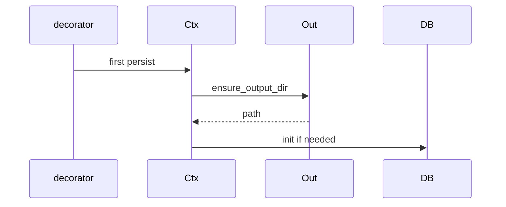
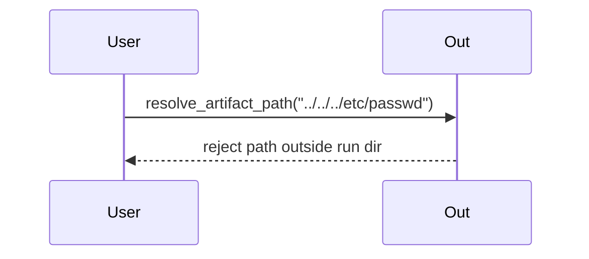

# DDD: Output Directory and Artifacts

## Responsibilities

Allocate timestamped output directories under `outputs/`, resolve relative artifact paths, register artifact rows in SQLite.

## Public API surface

```python
def allocate_run_directory(cwd: Path, logical_name: str) -> Path
def ensure_output_dir(ctx: RuntimeContext, logical_name: str) -> Path
def resolve_artifact_path(relative_path: str) -> Path  # under active output dir
def register_artifact(kind: str, path: Path, description: str = "") -> int
```

## Naming ([ADR-008](../decisions/adr-008-output-naming.md))

- Pattern: `%Y-%m-%d_%H%M%S_<sanitized_logical_name>`
- Sanitize: `[a-zA-Z0-9_-]`, max 64 chars
- Root: `Path.cwd() / "outputs"`

## Layout policy

- Default flat: `debug.log`, `execution.sqlite`, `summary.txt` at run root
- Subdirs created only when relative path contains `/` (e.g. `traces/foo.csv`)

## Data written

| Path | When |
|------|------|
| `outputs/<run>/` | First `ensure_output_dir` |
| Files under run dir | User/plugin calls |
| `artifacts` table row | `register_artifact` |

## Sequence — happy path



## Sequence — invalid path



## Extension points

Plugins call `register_artifact` for large files.

## Summary writer (Wave 3)

```python
# colosseum/summary/writer.py
class SummaryWriter:
    def write(self, output_dir: Path, aggregator: ResultAggregator, ctx: RuntimeContext) -> Path
```

Called once from `endex()` before process exit per [ADR-007](../decisions/adr-007-summary-artifact.md). Writes `summary.txt` with version, suite/test name, counts by status, overall result, failed required verifications list.

## Open issues

- Absolute artifact paths: disallow in v1.

## References

- [ffo-execution-evidence.md](../features/ffo-execution-evidence.md)
- [ADR-007](../decisions/adr-007-summary-artifact.md), [ADR-008](../decisions/adr-008-output-naming.md)
