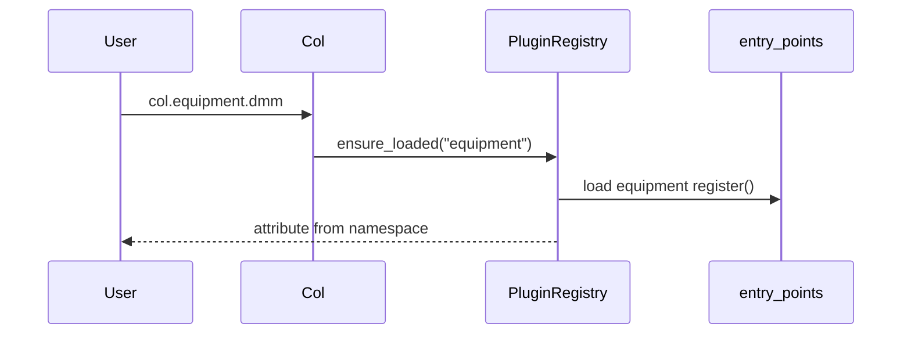
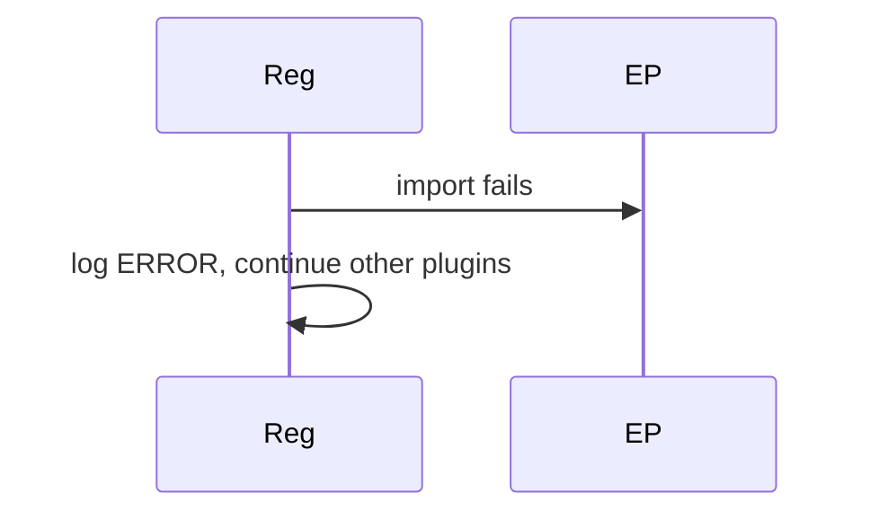

# DDD: Plugin Registry and Namespace

> **Documentation note:** Normative behavior is in [mvp/scope.md](../mvp/scope.md), Sphinx user guides, and the codebase. Wave 1/2/3 references below are historical sequencing only.


## Responsibilities

Discover entry points, invoke `register(registry)`, expose lazy `col.<namespace>` proxies, track measurement/verification registry for docs, and collect config section declarations from extensions.

## Public API surface

```python
@dataclass(frozen=True)
class ConfigSectionSpec:
    dotted_path: str
    id_field: str
    required_keys: Tuple[str, ...] = ()

class PluginRegistry:
    def register_namespace(self, name: str, module: types.ModuleType) -> None
    def register_callable(self, fn: Callable, kind: str) -> None
    def register_config_section(self, spec: ConfigSectionSpec) -> None
    def register_config_validator(self, dotted_path: str, fn: Callable) -> None
    def iter_config_sections(self) -> Iterable[ConfigSectionSpec]
    def get_namespace(self, name: str) -> Any
    def load_all(self, order: Optional[List[str]] = None) -> None
```

## Entry point contract

```python
def register(registry: PluginRegistry) -> None:
    import colosseum_equipment as pkg
    registry.register_namespace("equipment", pkg)
    registry.register_config_section(
        ConfigSectionSpec("equipment.psu", "psu_id", required_keys=("resource",))
    )
    registry.register_config_section(
        ConfigSectionSpec("equipment.dmm", "dmm_id", required_keys=("resource",))
    )
    # ... serial, etc.
```

`pyproject.toml`:

```toml
[project.entry-points."colosseum.plugins"]
equipment = "colosseum_equipment:register"
shared = "colosseum_shared:register"
```

Config loading calls `load_all()` (or loads sections lazily before normalize) so section specs are registered before TOML normalization.

## Collision policy ([ADR-009](../decisions/adr-009-plugin-namespace-collisions.md))

Log WARNING; replace existing namespace on duplicate `register_namespace`.

Duplicate `register_config_section` for same `dotted_path`: WARNING; last spec wins.

## Data written

None directly; plugins write via context.

## Sequence — lazy load



## Sequence — failed plugin



## Extension points

This module **is** the extension point.

## References

- [ADR-002](../decisions/adr-002-plugin-registration.md)
- [ddd-configuration.md](ddd-configuration.md)
- [ffo-extensions-plugins.md](../features/ffo-extensions-plugins.md)
