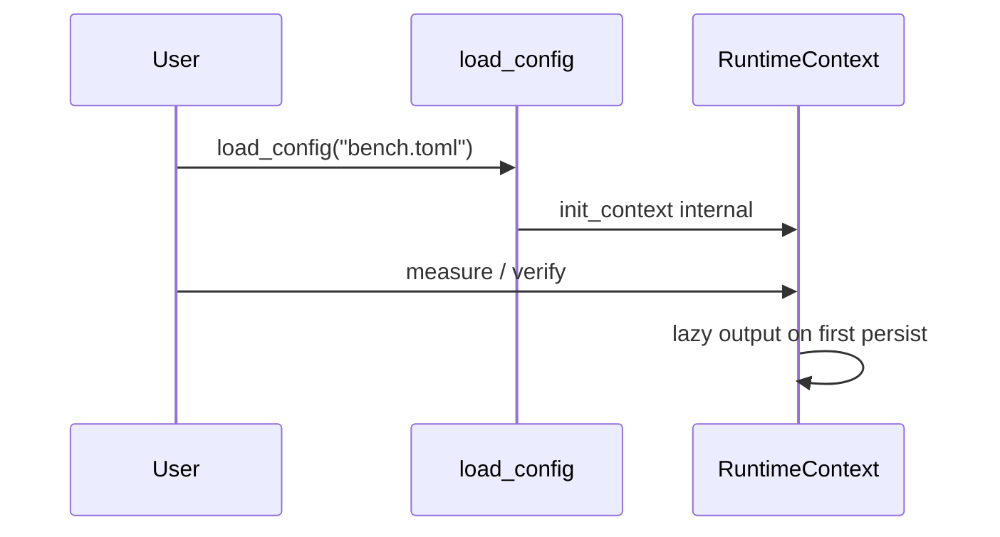
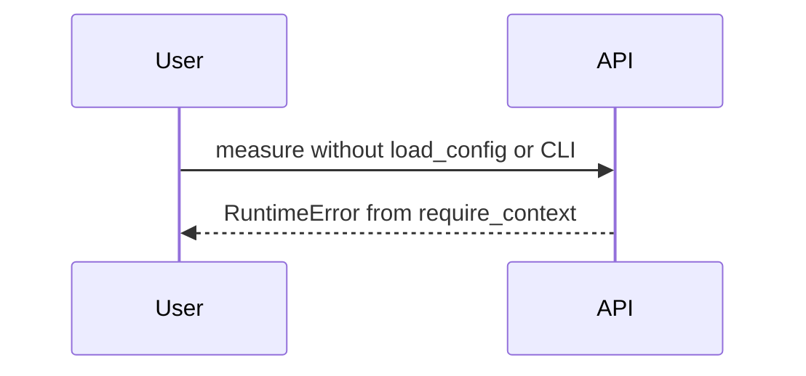

# DDD: Runtime Context

> **Documentation note:** Normative behavior is in [mvp/scope.md](../mvp/scope.md), Sphinx user guides, and the codebase. Wave 1/2/3 references below are historical sequencing only.


## Responsibilities

Own global active runtime state for v1: configuration, paths, DB manager, logger, plugin registry, aggregation, active test/suite names.

## Initialization (architecture §7)

The global context is initialized by **exactly one** of:

1. **`col.config.load_config(path)`** — primary path for direct Python tests
2. **Command-line runner** — `colosseum run` / `colosseum run-suite`, which loads config when `--config` is passed

There is no separate public “manual init” step for test authors. `init_context()` is an **internal** function called by `load_config` and the runner.

### Direct Python (recommended)

```python
import colosseum as col

def main():
    col.config.load_config("bench.toml")
    col.equipment.psu.set_output(psu_id=1, enabled=True)
    col.equipment.dmm.measure_voltage(dmm_id=1, channel=1, key="vrail_3v3")
    col.equipment.dmm.verify_voltage(key="vrail_3v3", expected_val=3.3, tolerance=0.1)

if __name__ == "__main__":
    main()
    col.endex()
```

`load_config`:

1. Parses and normalizes TOML (including plugin-registered sections)
2. Calls internal `init_context(test_case_name=..., config_path=...)`
3. Does **not** allocate output directory until first log/DB write (lazy)

Test scripts should call `load_config` at the start when bench config is required. If the bench is already prepared and no config is needed (Wave 1 stub tests), the first measurement/verification or CLI wrapper may initialize context with `config_path=None` — runner supplies `test_case_name` from the script path.

### CLI

```bash
colosseum run tests/test_power_rails.py --config configs/bench.toml
```

Runner calls `load_config` when `--config` is set; otherwise `init_context` with `config_path=None` only.

## Public API surface

```python
# colosseum/context.py — internal init, public getters
class RuntimeContext:
    config: Optional[ConfigStore]
    output_dir: Optional[Path]
    db: DatabaseManager
    logger: logging.Logger
    plugin_registry: PluginRegistry
    result_aggregator: ResultAggregator
    test_case_name: str
    suite_name: Optional[str]
    config_path: Optional[Path]
    framework_version: str
    phase: str  # setup | test | teardown

def get_context() -> RuntimeContext
def require_context() -> RuntimeContext  # RuntimeError if never initialized

# Internal — not documented in user quickstart
def init_context(
    *,
    test_case_name: str,
    suite_name: Optional[str] = None,
    config_path: Optional[Path] = None,
) -> RuntimeContext
```

## Lifecycle

1. **Uninitialized:** `import colosseum` is safe; APIs call `require_context()` → `RuntimeError` (“call col.config.load_config or use colosseum run”).
2. **Initialized:** via `load_config` or runner only.
3. **Output allocation:** Lazy on first persist via `context.ensure_output_dir(logical_name)`.
4. **Shutdown:** `col.endex()` from the test script and/or runner `finally` (see [ddd-results-exit-codes.md](ddd-results-exit-codes.md)).

## Global context policy

- Single active context per process (v1).
- No context-manager API in MVP.

## Data written

Indirect: triggers output, DB, log on subsystems.

## Sequence — direct Python



## Sequence — error path



## Extension points

Plugins receive active context on `register(registry)`.

## Open issues

- Thread-local context for future async: post-MVP.

## References

- [ffo-single-test-execution.md](../features/ffo-single-test-execution.md)
- [ddd-configuration.md](ddd-configuration.md)
- Architecture §7
