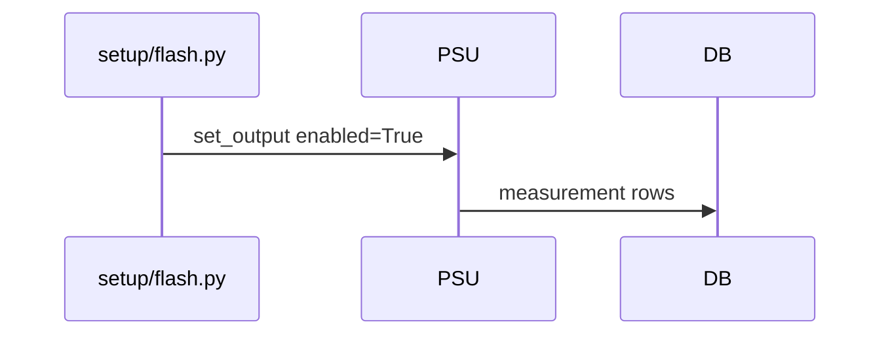

# DDD: Setup and Teardown Execution

## Responsibilities

Execute suite setup/teardown Python scripts with same runtime APIs as tests; record phase in metadata; define failure propagation.

## Public API surface

Internal:

```python
def run_script(path: Path) -> None:
    """run_path with __name__ == __main__ semantics; failures propagate."""
```

Scripts are ordinary Python files using `import colosseum as col`.

## Shared state ([ADR-004](../decisions/adr-004-setup-teardown-state.md))

- Same `output_dir` and `execution.sqlite` as parent suite run
- `run_metadata.phase` updated before each script
- Measurements/verifications tagged with `active_script` in metadata or events

## Failure policy (v1)

| Phase | On uncaught exception | On required verify FAIL |
|-------|----------------------|-------------------------|
| setup | Abort test list; suite ERROR | Abort test list |
| test | Continue suite (default) | Continue suite |
| teardown | Log; exit `1` at end | exit `1` |

Setup failure still runs teardown scripts.

## Data written

Events: `phase_enter:setup`, `script_start:<path>`, `script_fail:<path>`, etc.

## Sequence — setup uses equipment



## Extension points

None.

## Open issues

- `continue_on_test_failure=false` suite flag: post-MVP.

## References

- [ddd-suite-orchestration.md](ddd-suite-orchestration.md)
- [ffo-test-suites.md](../features/ffo-test-suites.md)
