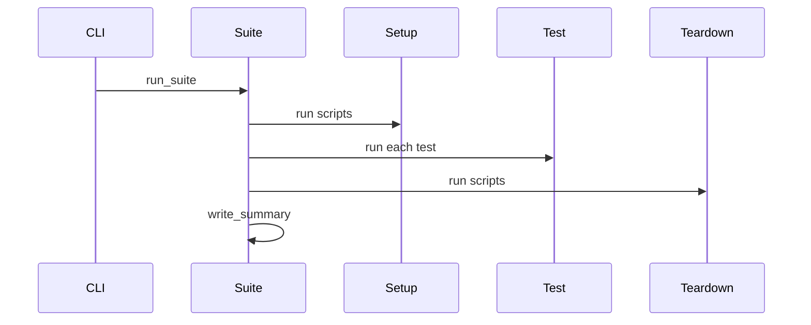
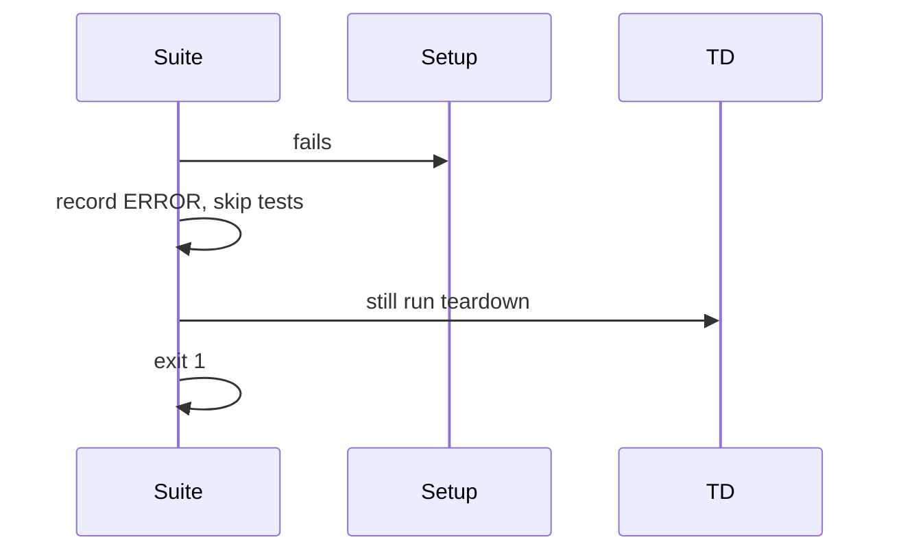

# DDD: Suite Orchestration

## Responsibilities

Parse suite TOML, drive setup → tests → teardown sequence, maintain phase metadata, invoke summary writer, return exit code.

## Public API surface

```bash
colosseum run-suite <suite.toml> [--config PATH] [--verbose]
```

```python
# colosseum/runner/suite.py
def run_suite(suite_path: Path, config_path: Optional[Path]) -> int
def load_suite_toml(path: Path) -> SuiteDefinition

@dataclass
class SuiteDefinition:
    name: str
    setup: List[Path]
    tests: List[Path]
    teardown: List[Path]
```

## Suite TOML schema

| Field | Required | Type |
|-------|----------|------|
| `name` | yes | string |
| `tests` | yes | list of strings (paths) |
| `setup` | no | list of strings |
| `teardown` | no | list of strings |

## Path resolution

Paths relative to directory containing `suite.toml`.

## Orchestration loop

```python
init_context(suite_name=name, test_case_name=name, config_path=config)
load_config(config)
ensure_output_dir(name)
set_metadata(phase="setup")
for script in suite.setup:
    run_script(script)  # abort suite on failure

set_metadata(phase="test")
for i, test in enumerate(suite.tests):
    set_metadata(test_index=str(i), active_script=str(test))
    run_script(test)

set_metadata(phase="teardown")
for script in suite.teardown:
    run_script(script)

write_summary()
return aggregator.exit_code()
```

## Data written

`run_metadata`: `suite_name`, `phase`, `active_script`, `test_index`

## Sequence — happy path



## Sequence — setup failure



## Extension points

None.

## References

- [ffo-test-suites.md](../features/ffo-test-suites.md)
- [ddd-setup-teardown.md](ddd-setup-teardown.md)
- [ADR-004](../decisions/adr-004-setup-teardown-state.md)
